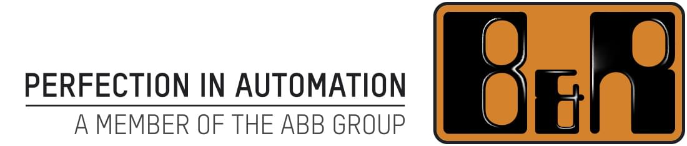
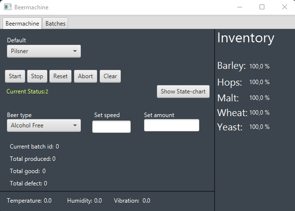
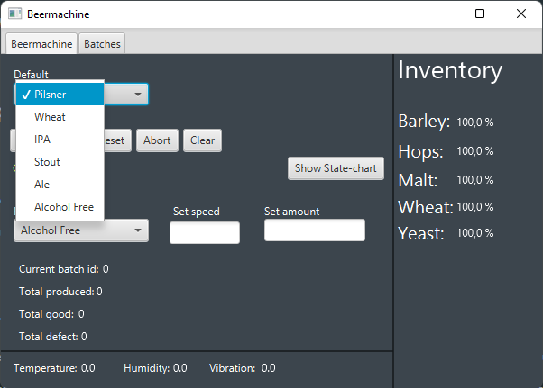
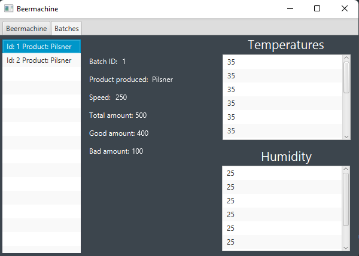

<div id="top"></div>
<!-- PROJECT LOGO -->
<br />
<div align="center">
  <a href="https://github.com/LiteralGod/Beermachine_JAVA">
    
  </a>

<h1 align="center">Project BeerMachine</h1>

  <p align="center">
    This project aims to automate the process of brewing beer, thus making it much more effective for
    the brewing company.
    <br/>
    <a href="https://github.com/LiteralGod/Beermachine_JAVA"><strong>Explore the docs »</strong></a>
  </p>
</div>

<!-- ABOUT THE PROJECT -->
## About The Project

<div align="center">
  <a href="https://github.com/LiteralGod/Beermachine_JAVA">
    
  </a>
</div>

Here's a blank template to get started: To avoid retyping too much info. Do a search and replace with your text editor for the following: `LiteralGod`, `Beermachine_JAVA`, `twitter_handle`, `linkedin_username`, `email`, `email_client`, `project_title`, `project_description`

<p align="right">(<a href="#top">back to top</a>)</p>


### Built With

* [Java](https://docs.oracle.com/en/java/)
* [Docker](https://www.docker.com/)
* [JavaFX](https://openjfx.io/)
* [MySQL](https://www.mysql.com/)
* [Maven](https://maven.apache.org/)
* [Laravel](https://laravel.com)
* [OPC UA](https://opcfoundation.org/about/opc-technologies/opc-ua/)
* [JavaScript](https://www.javascript.com/)

<p align="right">(<a href="#top">back to top</a>)</p>


<!-- GETTING UP AND RUNNING -->
## Getting up and Running

This is an example of how you may give instructions on setting up your project locally.
To get a local copy up and running follow these simple example steps.

* Open up a terminal in the `Main` directory.
* Type 
```sh
docker-compose up -d
```
into the terminal, then wait for the command to complete.
* run the `start.bat` file, in the `resources` directory.
* Now run the `FXMain` class in the `Presentation` under `Main` directory.

<p align="right">(<a href="#top">back to top</a>)</p>

<!-- USAGE EXAMPLES -->
## Usage

<div align="center">
  <a href="https://github.com/LiteralGod/Beermachine_JAVA">
    
    
  </a>
</div>


<p align="right">(<a href="#top">back to top</a>)</p>

<!-- GroupMembers -->
## Group Members

* [Frederik Mertz](https://github.com/MertzA)
* [Maria Hansen](https://github.com/MariaMHansen)
* [Mikkel Dolleris](https://github.com/Dolleriz)
* [Nicolai Walther](https://github.com/NickBlakW)
* [Nikolaj Rydeberg](https://github.com/NikoRydeberg)
* [Thomas Christensen](https://github.com/LiteralGod)

<p align="right">(<a href="#top">back to top</a>)</p>